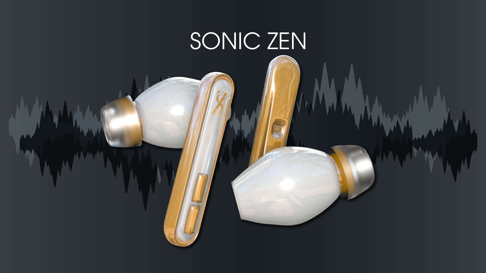

# sonic_zen promo page
Welcome to the Sonic Zen promotional page, where cutting-edge technology meets immersive sound.

# description
Sonic Zen introduces a new era of earbud technology, designed to deliver an unparalleled audio experience. These futuristic earbuds are crafted with the latest advancements in audio engineering, providing you with crystal-clear sound and a truly immersive listening environment.

# key features
Immersive Sound: Experience music like never before with Sonic Zen's state-of-the-art sound technology. Every note, every beat, delivered with precision and clarity.

Comfortable Fit: Ergonomically designed for a secure and comfortable fit, ensuring you can enjoy your music for hours on end.

Wireless Connectivity: Say goodbye to tangled wires. Sonic Zen seamlessly connects to your devices via Bluetooth, giving you the freedom to move without constraints.

Long-lasting Battery Life: With an extended battery life, Sonic Zen keeps the music playing all day long, so you can stay in the zone.

Noise Cancellation: Block out distractions and immerse yourself fully in your music, thanks to Sonic Zen's advanced noise cancellation technology.

Sleek Design: Aesthetically pleasing, the Sonic Zen earbuds are a perfect blend of style and functionality.

# version / history
1.0 - layout with grid system 

# how to use
1.Clone the Repo / Download the Files

2.Get started by cloning the repository or downloading the files to your local system.
Load it in Your System

3.Open the downloaded files in your preferred web browser.
Experience the Future of Audio

4.Navigate through the page using your mouse or touchpad to explore the features of Sonic Zen.

# functionality
Parallax scroll 

# contributing
Sahilkumar Gosaliya - Student at Fanshawe

# license
MIT
